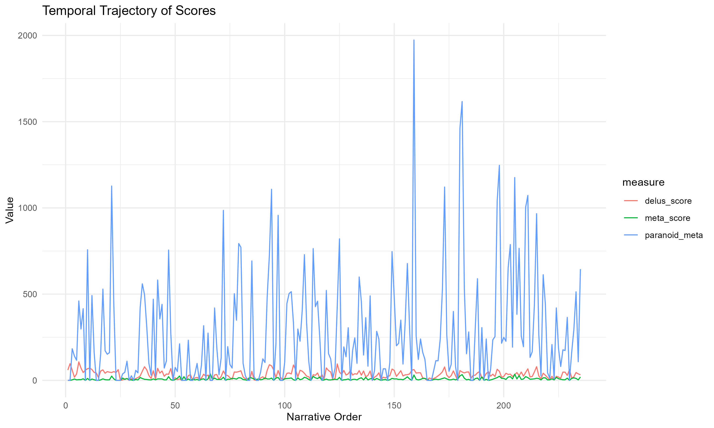
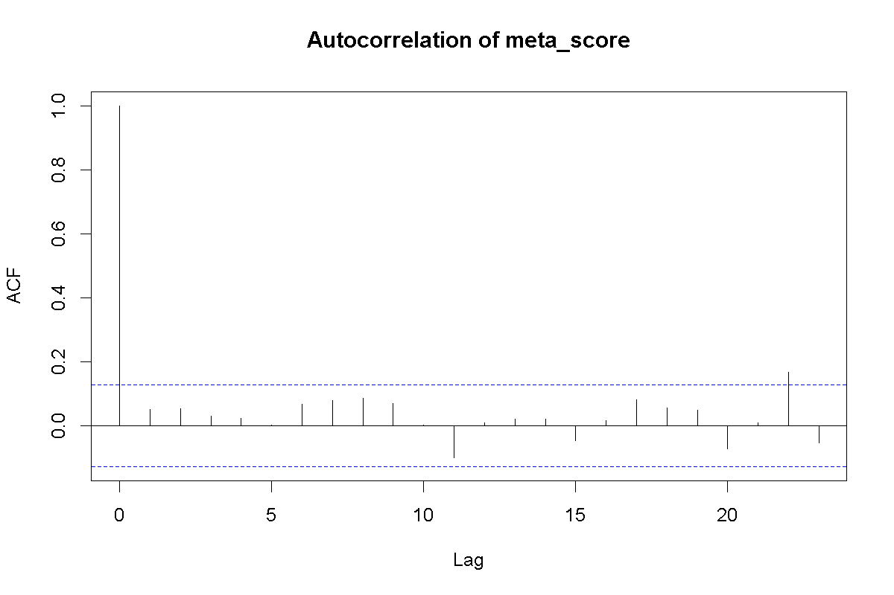

# Results

## Descriptive Profile of the Segmented Corpus

The manually curated benchmark corpus was segmented into 235 paragraph-level units. Segment length ranged from 28 to 393 words, with a mean of 290.4 words and a median of 310.0 words. This distribution indicates that the corpus retained substantial paragraph-level variability while avoiding the fragmentation produced by OCR-based line segmentation.

The resulting dataset provided the basis for the computation of three paragraph-level variables: normalized meta-communication density (`meta_score`), normalized delusional-ontology density (`delus_score`), and their multiplicative coupling index (`paranoid_meta`).

{#fig-time-series width=90%}

## Global Association Between Meta-Communication and Delusional Ontology

To test the monotonic escalation hypothesis, we estimated the Pearson correlation between normalized meta-communication scores and normalized delusional-ontology scores across all segments. The correlation was weak and non-significant, *r* = .041, 95% CI [-.088, .168], *p* = .535.

This result does not support a global linear association between the two dimensions. In other words, passages richer in delusional-ontological vocabulary were not systematically associated with higher levels of meta-communicative framing across the corpus as a whole.

## Temporal Clustering of Meta-Communicative Activity

To assess whether meta-communicative framing exhibited temporal persistence across adjacent segments, we computed the autocorrelation function (ACF) of the meta-communication score. The first-lag autocorrelation was .052, and subsequent lags remained low in magnitude.

This pattern does not support the existence of robust temporal clustering in meta-communicative activity when considered in isolation. Meta-communicative signals therefore do not appear to organize into extended, self-sustaining stretches across narrative order.

{#fig-meta-acf width=70%}

## Lagged Association and Reactive Coupling

To test a simple local reactive model, we examined the association between the coupling index (`paranoid_meta`) and the one-step lag of delusional-ontology scores. The resulting Pearson correlation was small but statistically significant, *r* = .161, 95% CI [.033, .283], *p* = .0139.

This finding suggests a limited local dependency: increases in delusional-ontological intensity may be followed by modest increases in discursive coupling in the immediately subsequent segment. However, the effect size remains small, indicating that coupling cannot be reduced to a strong or deterministic one-step reactive process.

## Detection of Peak Regimes

Peak segments were defined as observations exceeding the 95th percentile of the coupling index. These segments represent passages in which meta-communicative framing and delusional ontology become simultaneously elevated relative to the rest of the corpus.

The peak structure remained episodic and sparse, indicating that the strongest forms of discursive coupling are concentrated in localized passages rather than diffusely distributed throughout the memoir.

{#fig-coupling-peaks width=90%}

## Lexical Differentiation Between Peak and Non-Peak Segments

To characterize the linguistic profile of high-coupling regimes, we compared peak and non-peak segments using log-likelihood keyness analysis (G²). This analysis identified the lexical features most strongly associated with peak passages and contrasted them with those characterizing the remainder of the corpus.

```{r keyness-peak-table, echo=FALSE, message=FALSE, warning=FALSE}
library(readr)
library(knitr)

peak_keyness <- read_csv("tables/keyness_peak_top.csv", show_col_types = FALSE)
kable(
  peak_keyness,
  caption = "Top peak-favoring terms from log-likelihood keyness analysis."
)
```

```{r keyness-nonpeak-table, echo=FALSE, message=FALSE, warning=FALSE}
library(readr)
library(knitr)

nonpeak_keyness <- read_csv("tables/keyness_nonpeak_top.csv", show_col_types = FALSE)
kable(
  nonpeak_keyness,
  caption = "Top non-peak-favoring terms from log-likelihood keyness analysis."
)
```

The keyness contrast indicates that peak and non-peak segments are not simply distinguished by raw intensity alone, but by differing lexical profiles. This supports the interpretation of peak passages as distinct discursive configurations rather than merely quantitatively stronger instances of surrounding narrative material.

## Interim Synthesis

Taken together, the results do not support a strong monotonic escalation account. Meta-communication and delusional ontology are not globally correlated in a statistically meaningful way, and meta-communicative activity does not display robust temporal clustering in isolation. At the same time, the lagged analysis suggests a modest local reactive dependency, and peak detection continues to identify sparse episodes of intensified coupling.

These findings favor a model of psychotic discourse that is weakly structured at the global level but punctuated by localized moments of heightened discursive coupling.